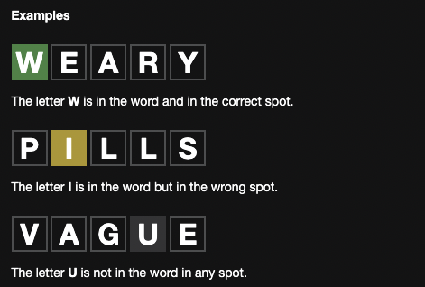

# Wordle

## Rules

1. 5 letters only
2. 6 tries
3. green char means correct spot/yellow means incorrect spot/grey means not in any spot
4. similar correct chars allowed



## Approach

- Have user input limited to 6 tries

- compare random generated word with user input and check for:

  - case sensitivity/non char input (0-9) & (@#%%^)/duplicate correct numbers
  - previous correct/incorrect char index positions
  - input word in list

- display input for user to see of all 6 rounds

## Code

1. create display of user input as they type (6) input texts and save input to compare.

Round sample - actual word vs try 1 > actual word vs try 2 and try 1 > actual word vs try 1/2/3 ...

- create text inputs and trigger color changes (green/grey/yellow) by character - EACH ROUND INDEPENDENT OF EACH OTHER

Sample overlay Siblings (actual word - input word)

```js
//actual word === input word 1-6) - siblings

//input word 1-6 (chars 1-5) - children
```

-## Requirements (Week 1 - Front End)

- {Instructor} Introduce students to Wordle, css in React, Flex-box, key
- Create a new github repo called wordleclone, clone the repo to your computer and add the link to populi
- First we will be creating the react components needed without hooking them up to the core functionality of the application.
- Create two new react components <WordleGrid> and <WordleKeyboard> and give them a simple html return statement:
  - const WordleGrid = (props) => {
    return (
    <div>
    WordleGrid
    </div>
    )
    }
  - const WordleKeyboard = (props) => {
    return (
    <div>
    WordleKeyboard
    </div>
    )
    }
- Add <WordleGrid> and <WordleKeyboard> to the <App> component return statement, you should see these two components in your browser now.
- In <App>, create two new state variables with accompanying setter functions: wordleGuessList and letterGuess.
  - wordleGuessList should be initialized to an array of 6 sub-array's (that we'll call wordleGuess), where each sub-array contains 5 empty strings (that we'll call wordleLetter):
    - [
      ["R", "E", "A", "C", "T"],
      ["", "", "", "", ""],
      ["", "", "", "", ""],
      ["", "", "", "", ""],
      ["", "", "", "", ""],
      ["", "", "", "", ""],
      ]
    - We're going to set one of the wordleGuess array's to be a word so we can get the css correct. Later, we can set this first array back to empty.
  - letterGuess should be initialized to an empty string ""
  - Pass wordleGuessList (but not setwordleGuessList) into <WordleGrid>
  - Pass letterGuess, setLetterGuess, wordleGuessList and setwordleGuessList into <WordleKeyboard> as a prop. Note: we have passed wordleGuessList into both <WordleGrid> and <WordleKeyboard> as a prop because we will need access to the wordleGuessList variable in both components since <WordleGrid> will be displaying wordleGuessList and <WordleKeyboard> will be modifying wordleGuessList
- We now need to display the wordleGuessList array of sub-array's as a grid of empty guess boxes in the <WordleGrid> component.
  - Create two new components <WordleGridRow> and <WordleGridLetter>
  - In <WordleGrid>, map through props.wordleGuessList to iterate through the wordleGuess sub-array's. This map should return the component <WordleGridRow> 6 times, one for each sub-array in props.wordleGuessList. The map function's first parameter should be named wordleGuess. Pass wordleGuess into the <WordleGridRow> component as a prop.
    - {props.wordleGuessList.map((wordleGuess)=>{
      return (
      <WordleGridRow wordleGuess={wordleGuess} />
      )
      })}
  - In <WordleGridRow>, map through props.wordleGuess. The map function's first parameter should be named wordleLetter. Return the <WordleGridLetter> component from this map function. Pass wordleLetter into the <WordleGridLetter> component as a prop.
    - {props.wordleGuess.map((wordleLetter)=>{
      return (
      <WordleGridLetter wordleLetter={wordleLetter} />
      )
      })}
  - Modify <WordleGridLetter> to display props.wordleLetter to the page as a letter inside a box.
  - If you did everything correctly, you should see a list of boxes display to the page. The first 5 should contain the letters R, E, A, C, and T. The rest (25 empty boxes out of 30 total boxes), should be empty boxes.
- We now need to create a front end component for our <WordleKeyboard>
  - Create a new variable keyList (does not have to be a state variable), that contains a list of clickable keys in our keyboard organized into sub-array row's.
    - const keyList = [
      ["q", "w", "e", "r", "t", "y", "u", "i", "o", "p"],
      ["a", "s", "d", "f", "g", "h", "j", "k", "l"],
      ["enter", "z", "x", "c", "v", "b", "n", "m", "backspace"]
      ]
  - Create two new components <KeyboardRow> and <KeyboardLetter>
  - Map through keyList to display 3 <KeyboardRow>'s and then map through <KeyboardRow> to display the sub-array of <KeyboardLetter>'s. Hint: these two components should function very similarly to <WordleGridRow> and <WordleGridLetter> respectively.
- Style you Wordle Clone grid and keyboard to appear like the real Wordle grid and keyboard.
  - Note: You do not need to have the exact css/styling of the real wordle. As long as you have your keyboard displaying in a similar manner as they do and you have wordleGuessList displaying in a 6 x 5 grid of wordle guesses and wordle letters, that is sufficient.
  - Hint: let flex-box do the heavy lifting here.
    - <WordleGrid> and <WordleKeyboard> should be display: flex, flex-direction: column
    - <WordleGridRow> and <KeyboardRow> should be display: flex, flex-direction: row
- If you did everything right, you should see a front-end very similar to Wordle except the first guess is the letters R, E, A, C, and T (see attached screenshot). Do not worry about the functionality yet, that will be the next assignment.
- Stretch goal: modify <WordleGridLetter> to take in a prop that sets the color of the wordleLetter box to either grey, green or yellow.
